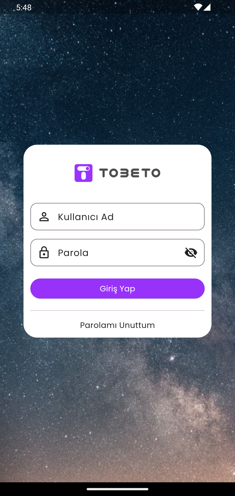
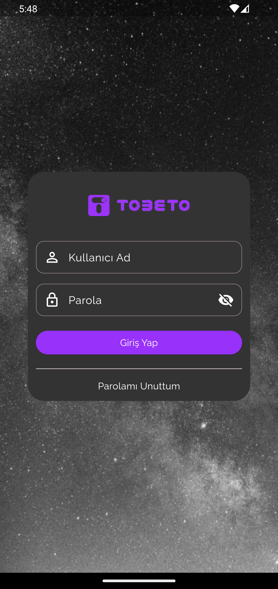
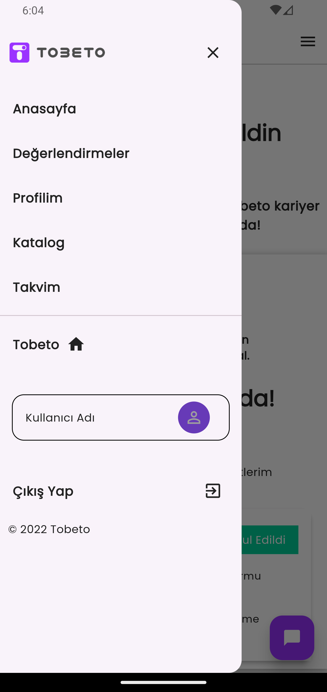
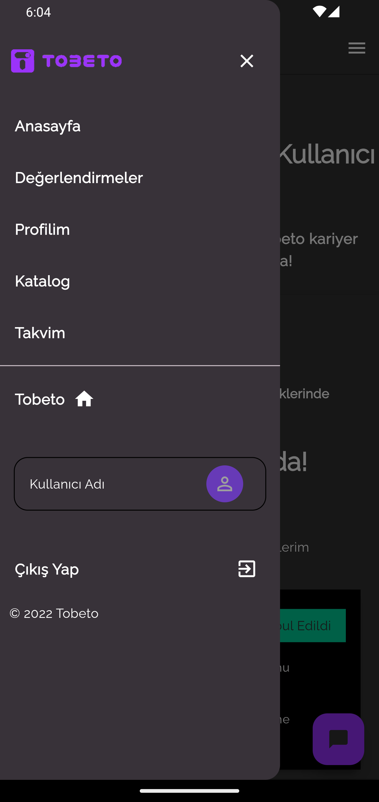

# tobeto_app

İstanbul Kodluyor eğitimi Tobeto Mobil Uygulaması

## Katkı Sağlayanlar 

[@Oya Özcan](https://github.com/OyaOzcan) tasarım ve geliştirme
 
[@Berkay Güneş](https://github.com/brkgns) tasarım ve geliştirme

## Renk Referansı

| Renk             | Hex                                                                
| ----------------- | ------------------------------------------------------------------ 
| Tobeto primary |   #9833FF |
| Tobeto secondry |  #00D29B |
| Tobeto backgroundColor |  #FFFFFF |
| textColor |  #515151   | 
| boxColor  |  #0E0B93 | 
| favoriteButtonColor  |  #FE4657 | 

## Ekran Görüntüleri
 

 

 

 

