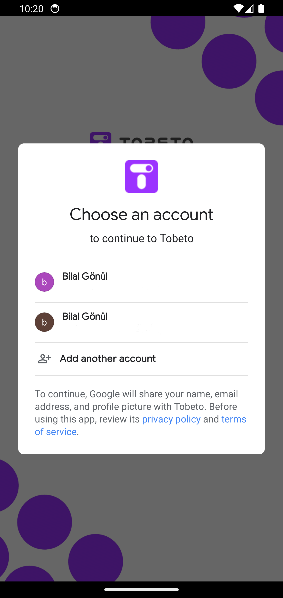

# tobeto_app

## Proje Tanıtımı
- Eğitim içerikleri bulunan, kişisel gelişim odaklı bir platform olan Tobeto'nun mobil uygulama prototipidir.

## Renk Referansı

| Renk             | Hex                                                                
| ----------------- | ------------------------------------------------------------------ 
| Tobeto primary |   #9833FF |
| Tobeto secondry |  #00D29B |
| Tobeto backgroundColor |  #FFFFFF |
| textColor |  #515151   | 
| boxColor  |  #0E0B93 | 
| favoriteButtonColor  |  #FE4657 | 

## Ekran Görüntüleri
 

## Welcome Page (Splash Ekranı)

## Register - Login Page / Google auth Page (Kayıt-Giriş Ekranı)

## Home Page (Ana Sayfa)

## Home Page / informations menu (Anasayfa-Bilgilendirme Menüleri)
- Başvurularım

- Duyuru ve Haberlerim

- Anketlerim

- Eğitimlerim

## Home Page / exams menu (Anasayfa-Sınavlarım Menüleri)
- Sınavlarım

## Reviews Page (Değerlendirmeler Sayfası)

- Rapor Sayfası

- Sınav Sayfası

